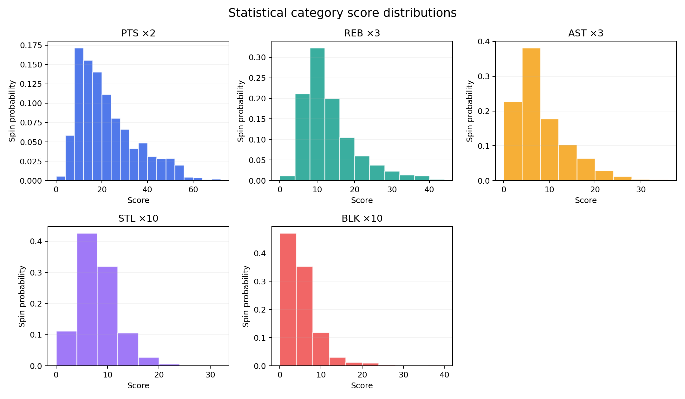
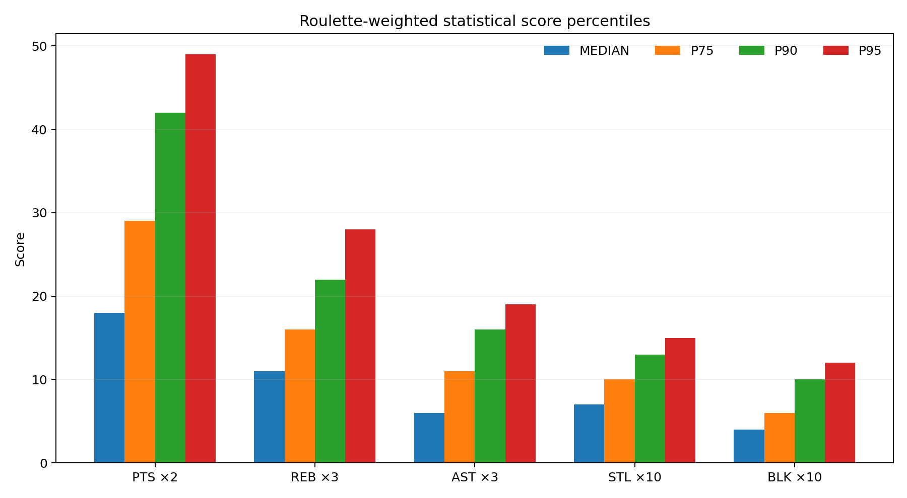
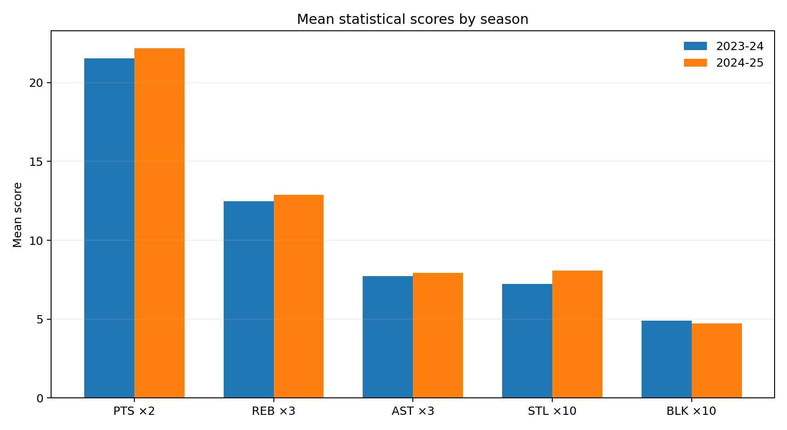
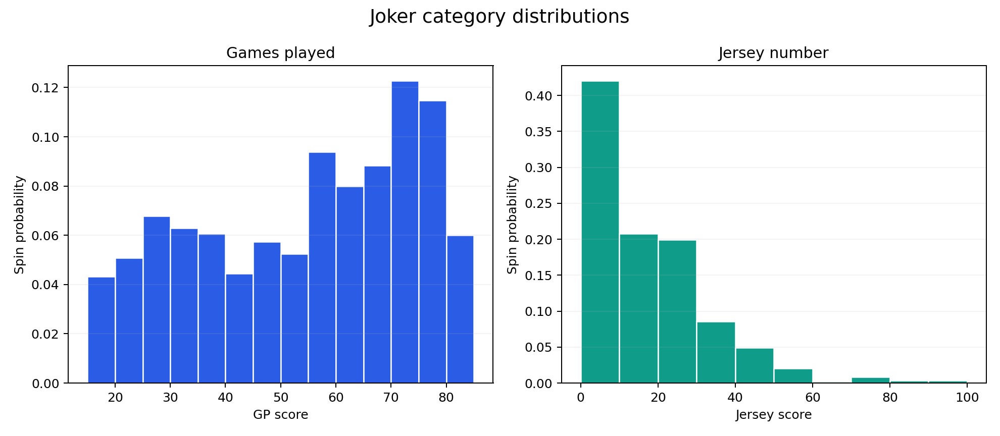
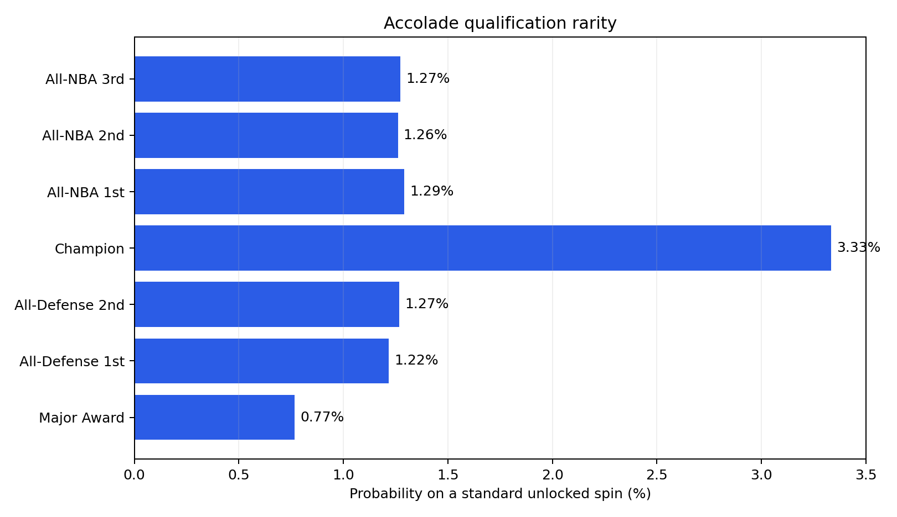

# NBA Roulette — Two-Season Distribution Report

**Seasons:** 2023–24 and 2024–25  
**Eligible player-team-season records:** 895  
**Eligibility:** 15+ GP and 10.0+ MPG for the selected team  
**Status:** Descriptive balance analysis; roulette strategy simulation is intentionally excluded.

## Executive Summary

- The five performance categories are not naturally equal after weighting. PTS has a roulette-weighted median of 18, while BLK has a median of 4.
- PTS supplies the highest routine scores. AST, STL, and especially BLK require specialist outcomes and are likely to constrain the 140-point Upper Bonus.
- GP is a consistently valuable Joker: median 57, P90 78, and maximum 82.
- Jersey is intentionally volatile: median 12, P90 35, and maximum 99. High numbers produce rare rescue or jackpot outcomes.
- Accolades are rare on a fully unlocked spin. Major Award qualifies 0.77% of the time, while each exact All-NBA team qualifies about 1.26%–1.29%.
- No scoring change is justified from distributions alone. The current 140-point bonus should remain a test hypothesis until lock-aware simulation measures attainable full-game scores.

## Method

The canonical observation is one **Player × Team × Season** record. The report distinguishes:

1. **Record-weighted distributions**, where each of the 895 rows counts equally.
2. **Roulette-weighted distributions**, matching the game rule: equal Season → equal Team → equal eligible Player.

The second view is the relevant gameplay baseline because team roster sizes vary. Scores use the GDD multipliers and round-half-up rule:

- PTS = PPG × 2
- REB = RPG × 3
- AST = APG × 3
- STL = SPG × 10
- BLK = BPG × 10
- GP = games played
- Jersey = final jersey number for the team stint

## Statistical Score Distributions

| Category | Mean | Median | P75 | P90 | P95 | Maximum |
|---|---:|---:|---:|---:|---:|---:|
| PTS ×2 | 21.9 | 18 | 29 | 42 | 49 | 69 |
| REB ×3 | 12.7 | 11 | 16 | 22 | 28 | 42 |
| AST ×3 | 7.8 | 6 | 11 | 16 | 19 | 35 |
| STL ×10 | 7.7 | 7 | 10 | 13 | 15 | 30 |
| BLK ×10 | 4.8 | 4 | 6 | 10 | 12 | 38 |





### Interpretation

- A P90 outcome is approximately 42 PTS points, 22 REB points, 16 AST points, 13 STL points, and 10 BLK points.
- Even strong percentile selections do not make the Upper Bonus automatic. The player must assemble quality across five different outcomes and categories.
- Category multipliers should not be judged by equal medians alone. Scarcity and the value of targeted locks are part of the intended strategy.

## Season Comparison

| Category | 2023–24 mean | 2024–25 mean | Change |
|---|---:|---:|---:|
| PTS ×2 | 21.5 | 22.2 | +0.6 |
| REB ×3 | 12.5 | 12.9 | +0.4 |
| AST ×3 | 7.7 | 7.9 | +0.2 |
| STL ×10 | 7.2 | 8.1 | +0.9 |
| BLK ×10 | 4.9 | 4.7 | -0.2 |




The two seasons have similar category means. No multiplier conclusion in this report depends on a single-season anomaly.

## Joker Categories

| Category | Mean | Median | P75 | P90 | P95 | Maximum |
|---|---:|---:|---:|---:|---:|---:|
| GP | 54.0 | 57 | 72 | 78 | 80 | 82 |
| Jersey | 16.5 | 12 | 24 | 35 | 44 | 99 |



GP is the safer Joker; Jersey has the heavier upside tail. That distinction supports the intended rescue mechanic without making the categories function identically.

## Accolade Rarity

| Category | Eligible records | Standard-spin probability | Score |
|---|---:|---:|---:|
| All-NBA Third | 10 | 1.27% | 20 |
| All-NBA Second | 10 | 1.26% | 30 |
| All-NBA First | 10 | 1.29% | 40 |
| Champion | 27 | 3.33% | 25 |
| All-Defense Second | 10 | 1.27% | 30 |
| All-Defense First | 10 | 1.22% | 40 |
| Major Award | 6 | 0.77% | 50 |



Major Award and exact All-Defensive teams are the rarest targets. Their balance cannot be evaluated from raw frequency alone because team, player, and season locks are designed to increase targeted odds.

## Observed Category Ceilings

| Category | Highest eligible player-team-season | Score |
|---|---|---:|
| PTS ×2 | Joel Embiid — PHI 2023-24 | 69 |
| REB ×3 | Domantas Sabonis — SAC 2024-25 | 42 |
| AST ×3 | Trae Young — ATL 2024-25 | 35 |
| STL ×10 | Dyson Daniels — ATL 2024-25 | 30 |
| BLK ×10 | Victor Wembanyama — SAS 2024-25 | 38 |
| GP | Austin Reaves — LAL 2023-24 | 82 |
| JERSEY | Jae Crowder — MIL 2023-24 | 99 |


## Dataset and Season Checks

- 2023–24: 441 eligible records.
- 2024–25: 454 eligible records.
- Every season contains all 30 teams.
- Eligible roster sizes range from 11 to 22 players per team-season.
- The analysis contains no missing jersey values and no records below the eligibility thresholds.

## Balance Decisions Supported Now

1. Retain the existing statistical multipliers for the first playable prototype.
2. Retain GP and Jersey as deliberately different Joker distributions.
3. Retain the fixed accolade scores until lock-aware simulation estimates hunt difficulty.
4. Keep **140 → +35** as the Upper Bonus test rule. This report identifies its likely bottlenecks but does not estimate strategic achievement rate.
5. Run the roulette simulation before changing scoring or adding artificial rarity adjustments.

## Reproduce

```bash
python scripts/analyze_distributions.py
```

This regenerates the JSON summary, CSV tables, charts, and this report from the two processed season datasets.
